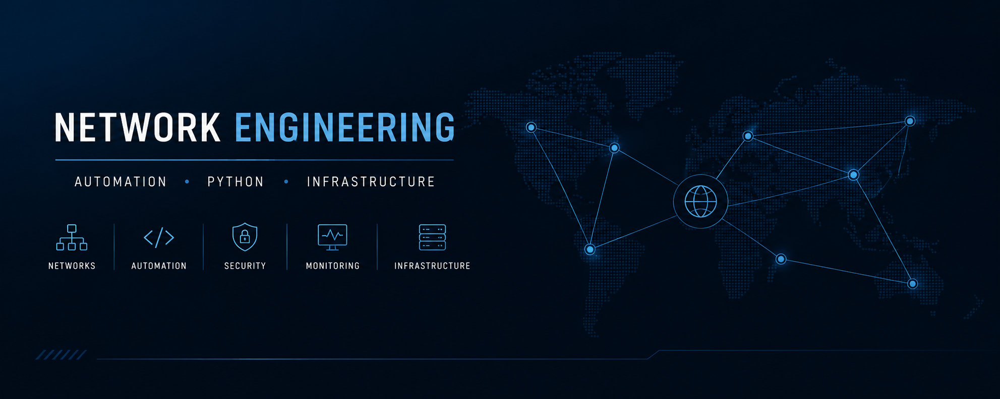

<h1 align="center">Christian NS</h1>

  <strong>Network Engineer | NOC Team Leader | Network Automation | Python</strong>

  

## 👨‍💻 Sobre mí

Soy Ingeniero de Redes enfocado en la operación, administración y automatización de infraestructura tecnológica.

Trabajo principalmente con redes empresariales, seguridad, monitoreo y operación de NOC, utilizando tecnologías de fabricantes como Cisco, Fortinet, Aruba, Meraki y Huawei.

Actualmente estoy profundizando en automatización de redes con Python, desarrollando herramientas para simplificar tareas operativas, mejorar la gestión de infraestructura y optimizar procesos dentro de entornos NOC.

También mantengo un entorno de laboratorio orientado a experimentar con Linux, Proxmox, Docker, Python, Network Automation e infraestructura, donde desarrollo y pruebo proyectos antes de llevarlos a escenarios reales.

 ## 🛠️ Tecnologías
 
 🌐 Networking
 Cisco · Fortinet · Aruba · Meraki · Huawei

 🐍 Automatización y desarrollo
 Python · Netmiko · Nornir · Ansible · Git

 🛡️ Seguridad y monitoreo
 FortiGate · FortiManager · Zabbix · PRTG

 🖥️ Infraestructura y laboratorio
 Linux · Proxmox · Docker · WSL · GitHub

 ## 🚀 Proyectos destacados

<table>
<tr>
<td width="50%">

### 📚 NOC Documentation Manager

Herramienta en Python orientada a la **gestión y documentación de operaciones NOC**, con generación de un portal documental, estructura de runbooks y validación de documentación.

**Tecnologías:**
`Python` `Typer` `Markdown` `Git`

</td>

<td width="50%">

### ⚙️ Network Automation Toolkit

Colección de herramientas y scripts para **automatización de tareas de red**, gestión de dispositivos, respaldos de configuración y operaciones recurrentes de NOC.

**Tecnologías:**
`Python` `Netmiko` `Nornir` `Pandas`

</td>
</tr>

<tr>
<td width="50%">

### 🐍 Python Environment Manager

Proyecto para facilitar la **gestión de múltiples entornos virtuales de Python**, permitiendo crear, administrar y acceder a entornos sin necesidad de navegar manualmente entre directorios.

**Tecnologías:**
`Python` `uv` `pip` `Git` `GitHub`

</td>

<td width="50%">

### 🧪 Network Automation Lab

Laboratorios y experimentos orientados a **Network Automation**, utilizando diferentes plataformas, herramientas y metodologías para automatizar operaciones de infraestructura.

**Tecnologías:**
`Python` `Nornir` `Netmiko` `Linux`

</td>
</tr>
</table>

## 📚 Actualmente explorando

🔹 **Network Automation** — Python, Nornir, Netmiko y automatización de operaciones de red.

🔹 **Infrastructure & DevOps** — Linux, Docker, Proxmox, Git y buenas prácticas de infraestructura.

🔹 **NOC Tooling** — Desarrollo de herramientas para documentación, monitoreo, troubleshooting y optimización de operaciones.

🔹 **Python Development** — CLI tools, gestión de entornos, APIs y desarrollo de utilidades para operaciones de infraestructura.

## 🔬 Laboratorio

Mi laboratorio personal es un entorno de experimentación orientado a **Networking, Automation e Infrastructure**, donde pruebo tecnologías, desarrollo herramientas y realizo laboratorios antes de llevarlas a escenarios reales.

### 🖥️ Infraestructura

`Proxmox` `Linux` `Docker` `WSL` 

### 🌐 Network Lab

`Cisco` `Fortinet` `Aruba` `Nornir` `Netmiko`

### ⚙️ Automatización y desarrollo

`Python` · `Netmiko` · `Nornir` · `Ansible` · `Git` · `GitHub`

### 🧪 Experimentos

* Automatización y gestión de dispositivos de red
* Desarrollo de herramientas para operaciones NOC
* Laboratorios de routing, switching y seguridad
* Pruebas de infraestructura y servicios self-hosted
* Experimentación con APIs y automatización

## 🤝 Contacto

¿Te interesa conversar sobre **Networking, Network Automation, infraestructura o proyectos técnicos**?

  
  

  <i>Construyendo herramientas, automatizando operaciones y compartiendo conocimiento.</i>

